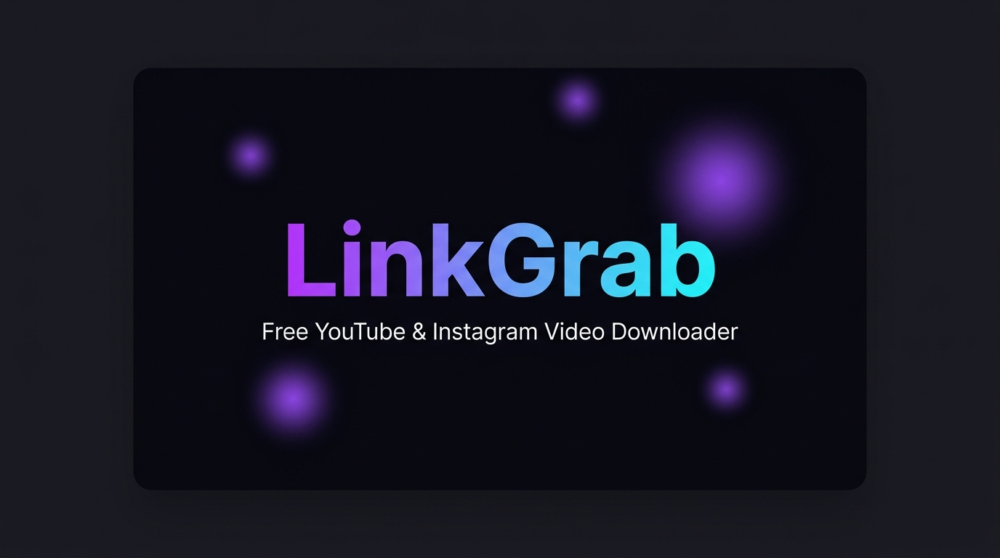

# ⚡ LinkGrab — All-in-One Video & Audio Downloader

<p align="center">
  
</p>

<p align="center">
  <b>Fast, ad-free, open-source YouTube & Instagram downloader with a modern glassmorphic UI.</b>
</p>

<p align="center">
  <a href="https://downloader-khaki.vercel.app/">🌐 <b>Live Demo (downloader-khaki.vercel.app)</b></a>
</p>

---

## ✨ Features

- 🎥 **YouTube Downloads**: Support for standard videos, Shorts, and Music in resolutions up to 4K (1080p, 720p, 480p, etc.).
- 📸 **Instagram Downloads**: Support for Reels, Video Posts, and IGTV.
- 🎵 **Audio Extraction**: High quality MP3 audio conversion (320kbps, 256kbps, 128kbps, 96kbps).
- 🖼️ **Instant Live Preview**: Dynamic metadata extraction with high-res thumbnails, titles, duration, and view counts.
- 💎 **Modern Dark UI**: Fluid animations, particle effects, and responsive glassmorphic cards.
- 🚀 **100% Ad-Free**: No popups, redirects, or spam trackers.

---

## 🛠️ Tech Stack

- **Frontend**: Vanilla HTML5, CSS3 (Modern Glassmorphism & Custom Properties), JavaScript (ES6+)
- **Backend**: Node.js, Express.js
- **Media Engine**: `yt-dlp` / `youtube-dl-exec`
- **SEO**: Structured Data (JSON-LD WebApplication & FAQPage), Open Graph, Twitter Cards, Semantic HTML5

---

## 🚀 Local Setup & Installation

1. **Clone the repository:**
   ```bash
   git clone https://github.com/YOUR_USERNAME/linkgrab.git
   cd linkgrab
   ```

2. **Install dependencies:**
   ```bash
   npm install
   ```

3. **Start the server:**
   ```bash
   npm start
   # or
   node server.js
   ```

4. Open your browser and visit [http://localhost:3000](http://localhost:3000).

---

## 📄 License & Disclaimer

This project is open-source and intended for **personal, educational, and archival use only**. Please respect content creators and copyright terms of service.
